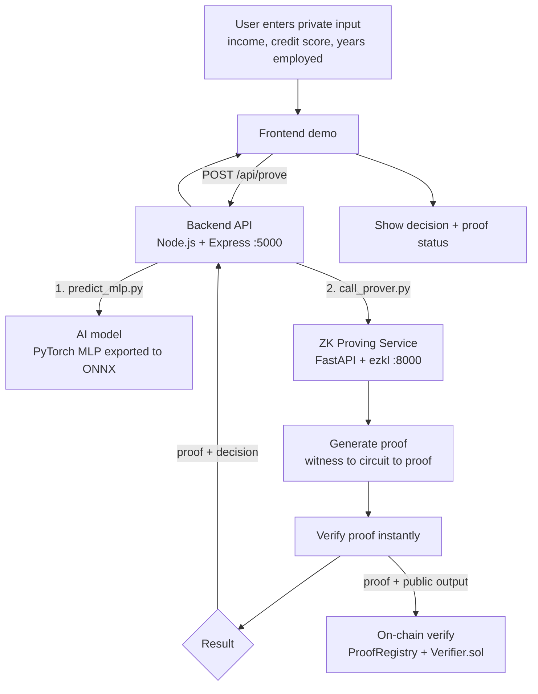
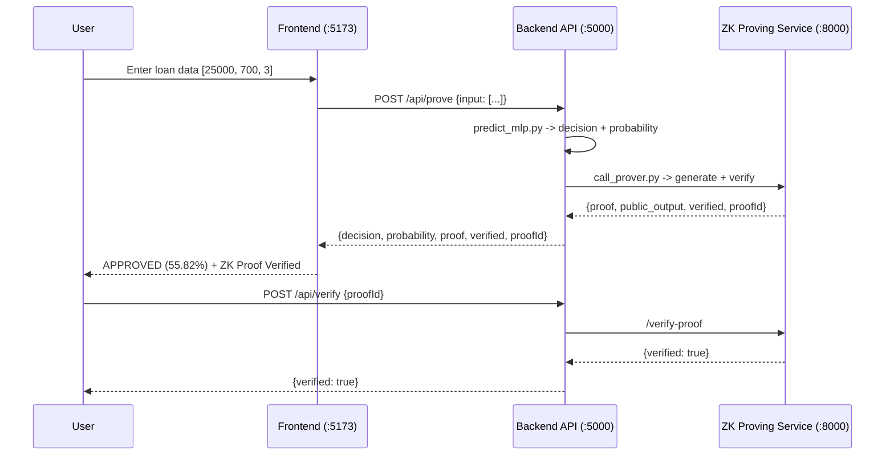
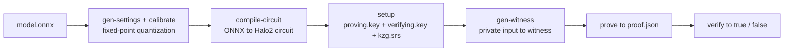

# Veriscore — Privacy-Preserving AI Decision Verification

> **Trust AI. Keep Data Private.**

Veriscore proves that an AI model produced a given output **without revealing the private input or the proprietary model weights** — using zero-knowledge proofs.

The demo use case is a **loan / credit-approval model**: a user submits private financial data, receives an approve/deny decision, and gets a small cryptographic **proof** that the real model ran correctly on their real data. Anyone — a verifier, an auditor, or a smart contract — can check the proof in milliseconds, with zero access to the sensitive inputs.

Built by a 4-person team as a major project and demonstrated locally end-to-end: *predict → prove → verify → on-chain verify*.

---

## 1. The Problem

To *trust* an AI decision, you today have two bad options:

1. **Run the model yourself** — but that requires the model's private (often proprietary) weights.
2. **Trust a server to run it for you** — but you must hand over your private data, and you have no proof the server didn't cheat, use a different model, or leak your data.

For sensitive domains (credit, insurance, healthcare), neither option is acceptable: the input is private, the model is often proprietary, and yet the decision must be independently verifiable.

## 2. The Solution

**Zero-Knowledge Machine Learning (zkML)** adds a third option:

> The server runs the model **and** generates a cryptographic **proof** alongside the answer. Anyone can verify the proof in milliseconds and be mathematically certain the output is correct — **without ever seeing the private input or the model's weights**.

In our loan demo:

- The **input** (income, credit score, years employed) is private.
- The **model** is a fixed, public MLP baked into the circuit (its weights are fixed at proof time).
- The **output** (decision + probability) is public and provably correct.

## 3. Key Innovations

1. **End-to-end zkML on a real, relatable use case** — loan fairness, not a generic "prove MNIST" toy.
2. **A plain-language explainer layer in the UI** — the cryptography is translated for non-technical viewers.
3. **Off-chain AND on-chain verification shown side-by-side** — the "seconds to prove, milliseconds to verify" property is visible, not just claimed.
4. **Measured, published benchmarks** — proof time (~1.5 s), proof size (26 951 B), quantization accuracy loss (abs logit error <= 0.065) — real numbers, not marketing.
5. **Honest engineering** — features that could not be implemented are reported as NOT AVAILABLE with exact technical reasons (see [Security, Privacy & Honest Limitations](#18-security-privacy--honest-limitations)).
6. **MLaaS-style model registry** — the proving service exposes `/api/models[/:id][/infer]` alongside proof endpoints.

## 4. How It Works (Workflow)





## 5. System Architecture

```
[ User Input (private) ]
        |
        v
+-----------------------------+
| 1. MODEL PIPELINE           |  <- Member A
|    Train / export (ONNX)    |
|    Q8.8 fixed-point version |
+---------------+-------------+
                | model.onnx + input.json
                v
+-----------------------------+
| 2. ZK PROVING SERVICE       |  <- Member B
|    ezkl circuit (Halo2/KZG) |
|    Generate + verify proof  |
+---------------+-------------+
                | proof.json + public output
                v
+-----------------------------+
| 3. BACKEND API              |  <- Member C
|    Orchestrates 1 & 2       |
|    REST + MLaaS registry    |
+---------------+-------------+
                | REST API
                v
+-----------------------------+
| 4. FRONTEND DEMO            |  <- Member D
|    Private input form       |
|    Result + proof status    |
|    On-chain verify section  |
+-----------------------------+
```

This mirrors classic zkML architecture (model -> circuit -> prover -> verifier) using **[ezkl](https://github.com/zkonduit/ezkl)** as the circuit/proving engine instead of hand-writing Halo2 circuits — the team focuses on integration, correctness, and a working demo rather than re-implementing cryptography research.

## 6. The AI Model

- **Task**: binary loan-approval classification (3 features -> 1 output).
- **Features**: `person_income`, `credit_score`, `person_emp_exp`.
- **Output**: approval probability. In the raw credit-risk dataset, `loan_status = 1` means **default / high risk** (measurably: lower income, higher loan rate, higher debt-to-income); the model is therefore trained on **`approval = 1 - loan_status`**, so a single sigmoid reads directly as P(approval). Decision: approved iff probability >= 0.5.
- **Architecture**: PyTorch MLP `3 -> 8 -> 4 -> 1`, ReLU activations, final sigmoid with **decision threshold 0.5**.
- **Training**: 250 epochs, Adam (lr 1e-3), `BCEWithLogitsLoss` with `pos_weight = reject/approve` (0.286) to counter the approval-majority bias, 80/20 stratified split (`random_state=42`). Test accuracy ≈ 0.78.
- **Normalization**: z-score (mean / std over the training set) applied *inside* the model graph, so the circuit proves the full pipeline including normalization.
- **Export**: exported to ONNX (`models/loan_model/model.onnx`) and validated with `onnxruntime`; PyTorch vs ONNX parity is exact (max abs logit diff = 0.0).
- **Data note**: in this dataset, `credit_score` and `person_emp_exp` have near-zero class separation; income is the main driver. The model's graded, monotonic income response comes from the data — nothing is hardcoded.
- **Quantization study**: a hand-written Q8.8 fixed-point reference (`model-pipeline/evidence_q8_8.json`) shows decision-identical results with abs logit error <= 0.065 vs. float (target model accuracy drop stays below 1-2%).

## 7. Verified Example

Measured against the live services (see `docs/reports/final-report.md`, `docs/architecture/api-registry.md`):

```
Input  [25000, 450, 1]  ->  probability 0.3919, decision: REJECTED      (real proof, verified: true)
Input  [30000, 450, 1]  ->  probability 0.4016, decision: REJECTED      (real proof, verified: true)
Input  [50000, 600, 3]  ->  probability 0.4098, decision: REJECTED      (real proof, verified: true)
Input  [80000, 750, 8]  ->  probability 0.5231, decision: APPROVED      (real proof, verified: true)
Input  [100000, 800, 10] -> probability 0.6056, decision: APPROVED      (real proof, verified: true)
Input  [120000, 800, 15] -> probability 0.6046, decision: APPROVED      (real proof, verified: true)
```

Each decision is accompanied by a **real, verified zero-knowledge proof** (`verified: true`) — neither class nor probability is hardcoded; the exact boundary comes from the trained model.

## 8. Zero-Knowledge Privacy

Ground truth is the calibrated circuit settings (`artifacts/settings.json`, EZKL 23.0.5):

| Property          | Value | Meaning |
|-------------------|-------|---------|
| `input_visibility`  | **Private** | The user's financial features never appear in the proof or the public transcript |
| `output_visibility` | **Public**  | The decision/probability is a public output anyone can read |
| `param_visibility`  | **Fixed**   | Model weights are baked into the circuit at setup time |
| `logrows`           | 12        | Proof size 2^12 rows (~26 951 B per proof) |
| scales             | `[11, 18]` | Fixed-point quantization scales |
| curve / commitment | `bn254` + KZG | Underlying curve and polynomial commitment |

Because the input is **private**, the witness never contains the raw user data as a public instance — the proof commits to it without revealing it. The keys are split: `proving.key` lives only on the prover host and is never served over HTTP, while `verifying.key` is public by design.

## 9. Cryptographic Pipeline

What the proving service automates for the demo model (each step is a real `prover_service.py` call, not manual CLI scripting):



For `[25000, 700, 3]` this produces a proof in **~1.5 s** that verifies in **~0.03 s** and weighs **26 951 B** — small enough that a browser or a smart contract can check it easily.

The proving service also persists proofs on disk (`artifacts/proofs/{proofId}/proof.json` + `meta.json`), letting anyone re-verify by proof ID.

## 10. Trustless Verification

- **Server-side**: `ezkl.verify` checks the proof against the public verifying key and public output. The backend runs this on every `/api/prove` and `/api/verify` call.
- **Client-side**: a **version-matched Solidity verifier** (generated by ezkl 23.0.5) is executed in an in-memory EVM — `CLIENT_SIDE_EVM_VERIFY true` (see `docs/architecture/client-verify.md`). This validates the *full* proof in a browser-runnable environment without the operator's server.
- **Note**: the npm WebAssembly engine path (`@ezkljs/engine@22.0.1`) is a **different release line** than ezkl 23.0.5 and cannot verify these proofs (version-format mismatch, documented in `docs/architecture/client-verify.md`). The version-matched Solidity path is why client-side verification *passes* anyway.

## 11. On-Chain Verification

- `blockchain-verifier/Verifier.sol` — the ezkl 23.0.5-generated Solidity verifier for this exact circuit.
- `blockchain-verifier/Deployer.sol` — a `ProofRegistry` contract that maps `vk_digest -> verifier` and exposes `register`, `verify`, and `verifierOf` (owner-guarded, MIT-licensed, `pragma ^0.8.0`).
- Verified in two environments (see `docs/architecture/blockchain-evm.md`):
  - **In-memory EVM**: deploy 18 ms, `verifyProof` 123 ms.
  - **Local chain** (ganache, chain id **1337**, `127.0.0.1:8545`, solc 0.8.20): real mined register + verify transactions, `Verified` event with `result = true`. Example on-chain `verifyProof` gas: **717 294**, calldata **4 964 B** (selector `1e8e1e13`); registry digest `0xb1e5...`, verifier `0x5fbd...a3`, registry `0xe7f1...f2`.
- **Scope note**: on-chain verification is **currently demonstrated on a local EVM development chain** — it deploys and verifies genuine proofs, but has not been shipped to a public testnet (see [Future Scope](#20-future-scope)).

## 12. API Reference

### ZK proving service (FastAPI, port 8000)

| Method | Route | Request | Response |
|---|---|---|---|
| POST | `/generate-proof` | `{"input":[25000,700,3]}` | proof + public output + proofId |
| GET | `/proof/{proof_id}` | — | stored proof + metadata (404 if unknown) |
| POST | `/verify-proof` | `{"proofId":"..."}` | `{"verified":true}` |
| GET | `/health` | — | `{"status":"ok"}` |
| GET | `/api/models` | — | model registry listing |
| GET | `/api/models/{model_id}` | — | model detail (404 if unknown) |
| POST | `/api/models/{model_id}/infer` | `{"input":[25000,700,3]}` | logit / probability / approved |

### Backend gateway (Node.js + Express, port 5000)

| Method | Route | Request | Response |
|---|---|---|---|
| GET | `/api/health` | — | `{"status":"healthy","service":"Veriscore Backend API"}` |
| POST | `/api/predict` | `{"input":[25000,700,3]}` | `{success, modelVersion, prediction, decision, probability}` |
| POST | `/api/prove` | `{"input":[25000,700,3]}` (or `{"input_data":[[...]]}`) | `{success, modelVersion, prediction, decision, probability, proof, public_output, verified, proofId}` |
| POST | `/api/verify` | `{"proofId":"..."}` | `{success, verified}` |
| GET | `/api/models` | — | passthrough to :8000 |
| GET | `/api/models/{id}` | — | passthrough to :8000 |
| POST | `/api/models/{id}/infer` | `{"input":[...]}` | passthrough to :8000 |

### Example: full prove call

```bash
curl -X POST http://localhost:5000/api/prove \
  -H "Content-Type: application/json" \
  -d '{"input":[25000.0,700.0,3.0]}'
```

```json
{
  "success": true,
  "modelVersion": "v1",
  "prediction": 1,
  "decision": "approved",
  "probability": 0.5582,
  "proof": { "...": "ezkl proof object (hex_proof present)" },
  "public_output": [ ... ],
  "verified": true,
  "proofId": "8f53eac4-..."
}
```

`public_output` holds the public circuit instances — for this circuit only the rescaled model output is public, so the input (`[income, credit, years]`) never appears in it.

**Error handling** (no stack traces or filesystem paths ever reach the client): `400` invalid input / missing fields, `404` unknown proofId / model, `502` proving failure, `503` proving service not running. Malformed JSON returns a clean generic `400`.

## 13. Repository Map

```
veriscore/
|-- artifacts/                 ZK artifacts (settings, keys, SRS, compiled circuit, proofs store)
|   |-- settings.json          calibrated circuit settings (input Private, scales 11/18, logrows 12)
|   |-- model.compiled         ezkl-compiled circuit
|   |-- proving.key            private (never served over HTTP)
|   |-- verifying.key          public verification key
|   |-- kzg.srs                universal KZG setup
|   `-- proofs/                persisted proofs {proofId}/proof.json + meta.json
|-- backend-api/               Member C - Node.js/Express gateway (:5000)
|   |-- server.js              /api/predict, /api/prove, /api/verify, /api/models, /api/health
|   |-- predict_mlp.py         runs the ONNX model via onnxruntime
|   |-- call_prover.py         invokes prover_service.py (proof + verify)
|   `-- package.json           express, cors
|-- blockchain-verifier/       On-chain layer
|   |-- Verifier.sol           ezkl 23.0.5-generated Solidity verifier
|   |-- Verifier.abi
|   `-- Deployer.sol           ProofRegistry (vkDigest -> verifier)
|-- client-verify/             Client-side verification harness
|   |-- evm-client-verify.js   in-memory EVM verify (version-matched Solidity verifier)
|   |-- evm-registry-demo.js   delegate through ProofRegistry
|   |-- ethers-chain-demo.js   ethers.js + ganache local chain (mined txs)
|   |-- calldata.hex           proof calldata for on-chain verify
|   |-- proof.json, settings.json, verifying.key, kzg.srs   staged proof files
|   `-- package.json           ethers, solc, ganache, @ezkljs/verify, @ethereumjs/common
|-- docs/
|   |-- architecture/         apicontract, api-registry, blockchain-evm, client-verify
|   |-- research/             quantization, gpu-msm, privacy-audit
|   `-- reports/              final-report, GETTING_STARTED, ROADMAP, PROGRESS_LOG
|-- frontend/                 Member D - React + Vite demo (:5173)
|   |-- vite.config.js         port 5173, /api proxied to :5000
|   |-- public/
|   |   |-- images/            veriscore-logo.png, veriai-hero-background.png
|   |   `-- videos/            veriscore-bg.mp4
|   `-- src/
|       |-- App.jsx            page composition (landing/app view state)
|       |-- index.css          design system
|       |-- components/        Header, Hero, DemoForm, StatusPanel, ResultPanel,
|       |                      VerifyStepper, PrivacySection, PipelineFlow,
|       |                      ClientVerifyPanel, BlockchainPanel, RegistryPanel,
|       |                      HowItWorks, icons, useCountUp, useReveal
|       |-- pages/             Landing (landing page view) + Landing.css
|       `-- services/          api.js (fetchModels, submitProve)
|-- model-pipeline/            Member A - model training/export/quantization
|   |-- mlp_model.py           3-feature PyTorch MLP (3-8-4-1)
|   |-- train_final.py         final training + metrics
|   |-- export_mlp_onnx.py     ONNX export + validation
|   |-- q8_8_model.py          hand-written fixed-point reference
|   |-- loan_model_q8.onnx     quantized fallback
|   |-- evidence_q8_8.json     float vs Q8.8 decision consistency
|   |-- loan_data.csv          training data
|   `-- README.md              Member A handoff notes
|-- models/loan_model/         shared model artifacts
|   |-- model.onnx             the model the whole pipeline proves
|   `-- input.json             sample input [25000, 700, 3]
|-- zk-proving-service/        Member B - cryptographic core
|   |-- api_server.py          FastAPI endpoints (:8000)
|   |-- prover_service.py      ezkl pipeline wrapper (witness -> proof -> verify)
|   |-- configs/calibration_data.json
|   `-- requirements.txt       ezkl, onnx, onnxruntime, torch, fastapi, uvicorn, numpy
|-- e2e_test.py                end-to-end test suite (17 checks, see section 17)
`-- .gitignore                 excludes node_modules, *.onnx, *.key, proof.json, venv, etc.
```

## 14. Tech Stack

| Layer | Technology | Version proven in this repo |
|---|---|---|
| Model | Python + PyTorch + ONNX (+ hand-written Q8.8 reference) | Python 3.13.7 |
| ZK engine | [ezkl](https://github.com/zkonduit/ezkl) (Halo2/KZG, `bn254`) | 23.0.5 |
| ZK service | FastAPI + uvicorn | — |
| Backend | Node.js + Express + CORS | Node v24.14.0, npm 11.9.0 |
| Frontend | React + Vite | React ^18.3.1, Vite ^5.4.11 |
| On-chain | Solidity (ezkl-generated `Verifier.sol` + `ProofRegistry`), ethers.js v6, ganache | solc 0.8.20 |
| Client-side verify | In-memory EVM (@ethereumjs), version-matched Solidity verifier | — |
| Tests | Python standard-library HTTP test suite | 17/17 pass |

## 15. Quick Start (Windows)

Prerequisites: **Python 3.10+** (tested 3.13.7) and **Node.js 20+** (tested v24.14.0, npm 11.9.0).

### Terminal 1 — ZK proving service (:8000)

```powershell
cd zk-proving-service
python -m venv .venv
.\.venv\Scripts\Activate.ps1
pip install -r requirements.txt
python -m uvicorn api_server:app --port 8000
```

> If PowerShell blocks the activation script, run `Set-ExecutionPolicy -Scope Process Bypass` first, or use the venv's Python directly: `.\.venv\Scripts\python.exe -m uvicorn api_server:app --port 8000`.

### Terminal 2 — Backend API (:5000)

```powershell
cd backend-api
npm install
node server.js
```

Optional env vars: `PORT`, `PYTHON`, `PROVER_SERVICE_URL` (default `http://127.0.0.1:8000`).

### Terminal 3 — Frontend demo (:5173)

```powershell
cd frontend
npm install
npm run dev
```

Open **[http://localhost:5173](http://localhost:5173)**. The frontend proxies `/api` to the backend at :5000, which orchestrates the model and the proving service.

### Extra demos (each is standalone)

```powershell
cd client-verify
npm install
node evm-client-verify.js   # client-side verification in an in-memory EVM
node evm-registry-demo.js   # delegates through the ProofRegistry contract
node ethers-chain-demo.js   # ethers.js + local ganache chain (real mined txs)
```

## 16. Judge Demo Walkthrough

1. Start the three services (section 15) and open http://localhost:5173.
2. **Hero** explains the pitch: "Trust AI. Keep Data Private." with a mini model -> proof -> verify flow.
3. Scroll to the **demo**: enter loan data — annual income (USD/year, e.g. 25000), credit score (0–850, e.g. 700), years employed (e.g. 3).
4. Click **Generate Proof** — the status panel steps through *Connecting to proving service -> Running AI model -> Generating ZK proof -> Cryptographic verification* (proofs take ~1.5 s, the panel communicates that honestly).
5. **Result panel** shows the decision (APPROVED / REJECTED), the probability (e.g. **40.16% / REJECTED** for `[30000, 450, 1]`, **60.56% / APPROVED** for `[100000, 800, 10]`), chips for **ZK Proof Generated** and **Cryptographic Verification Verified**, and the proof ID.
6. **How the proof protects you**: privacy section explains raw inputs never appear in the proof; inputs are Private, weights Fixed, output Public.
7. **Pipeline** section traces model -> circuit -> setup -> witness -> proof -> verify.
8. **Client-side verification** shows the version-matched Solidity verifier checking the proof in an in-memory EVM — verification that needs no operator server.
9. **On-chain** section shows the `ProofRegistry` + `Verifier.sol` flow and the local-chain transactions.
10. **Registry** section lists the live `loan-v1` model (EZKL version, curve, visibility, GPU status).
11. For the skeptical judge: re-prove `[30000, 450, 1]` (REJECTED) or `[100000, 800, 10]` (APPROVED) and re-verify by proof ID; or run `python e2e_test.py` in a terminal for 17/17 live checks.

## 17. Tests & Verification

All numbers below are **measured** against the running services on the development machine (Windows, 13th-gen Intel i5, Python 3.13.7, Node v24.14.0, ezkl 23.0.5).

| Check | Result |
|---|---|
| `python e2e_test.py` | **17 / 17 PASS** (health, predict, prove, verify, invalid/malformed input, vite proxy path, persistence, registry, post-error health) |
| Proof generation | ~1.5 s per proof (2^12 rows) |
| Proof verification | ~0.03 s |
| Proof size | **26 902 B** per proof |
| Decision/probability parity | `[100000,800,10]` -> approved 0.6056; `[30000,450,1]` -> rejected 0.4016 (matches float model; PyTorch vs ONNX max abs logit diff = 0.0) |
| Q8.8 vs float | decision-identical; abs logit error <= 0.065 (`model-pipeline/evidence_q8_8.json`) |
| Client-side EVM verify | `CLIENT_SIDE_EVM_VERIFY true` (in-memory EVM) |
| On-chain verify | `REGISTRY_VERIFY true`, mined `Verified` event `result=true` on ganache chain id 1337 |
| Frontend build | `npm run build` clean (45 modules) |

Run the full suite:

```powershell
python e2e_test.py
```

## 18. Security, Privacy & Honest Limitations

**What the pipeline actually protects (verified):**

- Input privacy — `input_visibility = Private`; the witness never exposes raw inputs as public instances.
- Stateless verifiability — verification needs only the verifying key, the proof, and the public output.
- Key separation — `proving.key` is prover-host-only and never served; `verifying.key` is public by design.
- Only the final rescaled output is public — hidden-layer activations never leak.

**Honest limitations (from `docs/research/privacy-audit.md`):**

| Area | Status | Note |
|---|---|---|
| Server sees the raw input | by design | Proving happens server-side; ZK hides input from everyone *except* the operator. Client-side witness generation is future work. |
| Output is public | by design | `output_visibility = Public`; the decision is readable from the proof. |
| Weights are fixed/public | by design | `param_visibility = Fixed` — matches a public MLaaS model. |
| Transport | demo | Plain HTTP on localhost; production must sit behind TLS + auth. |
| Proving-key handling | demo | `proving.key` lives in the working tree; production should store it in a secrets vault / TPM. |
| Q8.8-in-ZK | **NOT AVAILABLE** | EZKL's fixed 2x14-bit limb tower cannot hold the Q8.8 graph's large intermediates (`docs/research/quantization.md`). |
| GPU / accelerated MSM | **NOT AVAILABLE** | No CUDA GPU/toolkit on the host; ezkl wheels expose no GPU API (`docs/research/gpu-msm.md`). |
| npm WASM verification of 23.0.5 proofs | **NOT AVAILABLE** | The published `@ezkljs/engine` is release-line 22.0.1; version mismatch (`docs/architecture/client-verify.md`). |
| Randomness / side channels | future | Not audited; out of scope for the local demo. |

## 19. Real-World Applications

Veriscore's architecture generalises to any domain where a private input, a (possibly proprietary) model, and an independently verifiable decision must coexist:

- **Credit & lending** — provable, auditable approve/deny decisions without exposing financial data or the credit model.
- **Insurance underwriting** — provable risk scores from private health/usage data.
- **Healthcare triage & eligibility** — verifiable model predictions while patient data stays private.
- **On-chain credit / DEX protocols** — smart contracts that verify model outputs before lending or pricing.
- **Regulated AI (fairness audits)** — a decision can be proven computed-by-this-exact-model, supporting audit and fair-lending compliance.
- **Any model marketplace** — buyers verify a model ran correctly without receiving the weights.

(These are application/motivation directions — the repo implements the full pipeline for the loan use case.)

## 20. Future Scope

- **Client-side witness generation / WASM proving** so the operator never sees inputs (requires `gen_settings` maturation and an ezkl 23.0.5-compatible WASM engine).
- **GPU-accelerated MSM** on machines with CUDA, to cut proof time further.
- **Q8.8-in-ZK** by recompiling the model with intermediate widths that fit EZKL's limb capacity.
- **Public testnet deployment** of `Verifier.sol` + `ProofRegistry` (the demo is proven on a local EVM chain).
- **TLS + API-key auth** on :8000/:5000 and key handling via a secrets vault / TPM.
- **More models** registered in the `/api/models` registry (the interface already supports several).
- **Async proof jobs** (submit `proofId`, poll status) — documented design in `docs/architecture/apicontract.md`, currently synchronous for demo simplicity.

## 21. Team Roles & Responsibilities

| Member | Folder | Responsibility |
|---|---|---|
| **Member A** | `model-pipeline/` | Model training/export, ONNX conversion, quantization study (Q8.8), accuracy evidence |
| **Member B** | `zk-proving-service/` | ezkl circuit setup, proof generation/verification service, MLaaS `/api/models` registry, on-chain verifier export |
| **Member C** | `backend-api/` | Express orchestration API, request validation, call_prover + predict_mlp integration, gateway passthrough |
| **Member D** | `frontend/` | React UI, demo flow, loading/error states, privacy + pipeline + registry + on-chain sections |
| **Everyone** | `blockchain-verifier/`, `client-verify/`, `docs/`, `e2e_test.py` | On-chain verification, client-side verification, documentation, end-to-end tests |

## 22. Why Veriscore

zkML tooling already exists (EZKL, Giza, Modulus Labs, RISC Zero) — but all of it is **developer infrastructure**, not a product that explains itself. Veriscore fills that gap:

1. A **real narrative use case** (loan fairness) instead of a generic tutorial demo.
2. A **plain-language explainer layer** in the UI for non-technical viewers.
3. **Off-chain and on-chain verification side-by-side**, making "prove in seconds, verify in milliseconds" tangible.
4. **Own, measured benchmarks** (proof time, proof size, quantization loss) — evidence of genuine engineering.
5. **First-class UI design** — a zkML demo that looks like a product, not a pasted terminal window.

We build **on top of** EZKL (the same way production zkML products do), concentrating our engineering on integration, privacy configuration, honest validation, and a demo that tells a story.

## 23. Smart India Hackathon Pitch

> **Trust AI. Keep Data Private.**
>
> Lenders, insurers, and banks make high-stakes decisions with AI — and consumers must trust those decisions with no way to audit them, while companies must protect both customer data and proprietary models. Veriscore runs an AI model inside a zero-knowledge circuit: it produces the decision *and* a cryptographic proof that the real model ran on the exact input submitted. Verification is instant — in a browser, on a server, or in a smart contract — and reveals **neither** the user's private data **nor** the model's weights. Our working demo proves loan decisions end-to-end (predict -> prove -> verify -> on-chain verify) with measured numbers: ~1.5 s to prove, ~0.03 s to verify, 26 KB proofs, and a 17/17 end-to-end test suite that no fake feature is hidden behind.

## 24. Documentation Index

| Doc | Contents |
|---|---|
| `docs/reports/final-report.md` | Phase 0-11 upgrade final report: results, measured numbers, NOT AVAILABLE items |
| `docs/architecture/blockchain-evm.md` | On-chain verification evidence (in-memory EVM + ganache chain 1337) |
| `docs/architecture/client-verify.md` | Client-side verification (version-matched Solidity, WASM mismatch explained) |
| `docs/architecture/api-registry.md` | MLaaS `/api/models` registry endpoints + measured responses |
| `docs/architecture/apicontract.md` | API contract between backend and prover (including async design notes) |
| `docs/research/quantization.md` | Q8.8 fixed-point study and EZKL limb-capacity limits |
| `docs/research/gpu-msm.md` | GPU / accelerated MSM investigation (NOT AVAILABLE, with reasons) |
| `docs/research/privacy-audit.md` | Privacy architecture: what is protected and honest limitations |
| `docs/reports/GETTING_STARTED.md` | Team onboarding: git workflow, branches, weekly sync |
| `docs/reports/ROADMAP.md` / `docs/reports/PROGRESS_LOG.md` | Week-by-week plan and progress evidence |
| `backend-api/README.md` | Backend API spec and handoff contract (owner notes) |
| `zk-proving-service/README.md` | Proving service pipeline and handoff contract |
| `frontend/README.md` | Frontend screens and demo plan |
| `model-pipeline/README.md` | Model pipeline tasks and handoff contract |

## 25. License

**No license file is included in this repository.** Until the team adds one, all rights are reserved under applicable copyright law. This is a student course/demo project; if you intend to use or redistribute any part of it, contact the team first.

## 26. Final Quality Checks

- All README content is verified against the actual repository (source files, docs, measured test output) — nothing is staged or aspirational unless explicitly labelled **Planned / Future Scope / NOT AVAILABLE**.
- No source code, backend, frontend, model, prover, or configuration files were modified for this README.
- Services run on the documented ports (`8000` uvicorn, `5000` node, `5173` vite) and the frontend proxying `/api -> :5000` is confirmed in `frontend/vite.config.js`.

---

**Veriscore — Trust AI. Keep Data Private.**