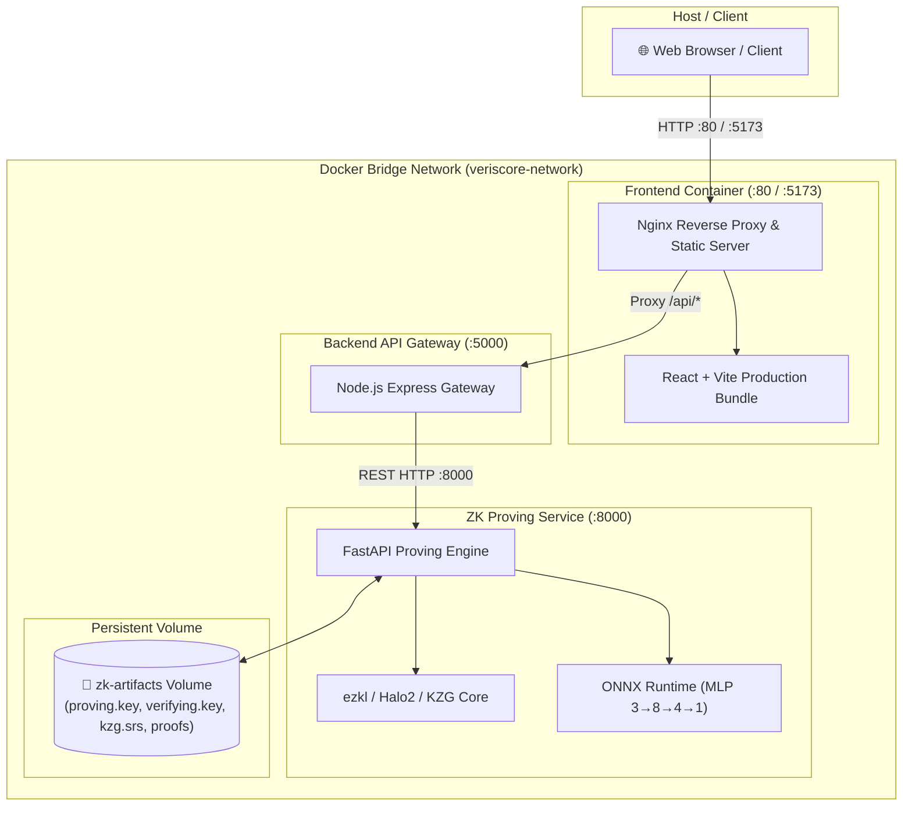

# Veriscore DevOps & Docker Master Guide

> A complete handbook on containerization, microservice orchestration, and GitHub Actions CI/CD pipelines for **Veriscore**.

---

## 1. System Architecture in Docker

Veriscore is containerized as three decoupled, production-grade microservices communicating over an isolated Docker virtual bridge network:



### Port & Service Mapping

| Service | Container Name | Base Image | Internal Port | Host Port | Role |
| :--- | :--- | :--- | :--- | :--- | :--- |
| **`frontend`** | `veriscore-frontend` | `nginx:1.27-alpine` | `80` | `80`, `5173` | Serves React static bundle + reverse proxies `/api/*` |
| **`backend-api`** | `veriscore-backend-api` | `node:20-alpine` | `5000` | `5000` | REST orchestration gateway & validation |
| **`zk-prover`** | `veriscore-zk-prover` | `python:3.11-slim` | `8000` | `8000` | EZKL circuit execution, ONNX inference, proof store |

---

## 2. Core Docker Concepts Explained

### 1. Multi-Stage Builds (`frontend-demo/Dockerfile`)
In development, Node.js + `node_modules` take up over **500 MB**. In production, users only need compiled HTML, CSS, and JS bundles.

```dockerfile
# Stage 1: Build the bundle with Node.js
FROM node:20-alpine AS builder
WORKDIR /app
COPY frontend-demo/package*.json ./
RUN npm ci
COPY frontend-demo/ ./
RUN npm run build

# Stage 2: Discard Node.js & node_modules; copy ONLY dist/ into tiny Nginx
FROM nginx:1.27-alpine AS runner
COPY --from=builder /app/dist /usr/share/nginx/html
COPY frontend-demo/nginx.conf /etc/nginx/conf.d/default.conf
EXPOSE 80
CMD ["nginx", "-g", "daemon off;"]
```
* **Result**: Image size drops from **>500 MB** to **~25 MB**, dramatically improving security (fewer attack vectors) and reducing deployment time.

---

### 2. Service Discovery & Docker DNS
Inside the Docker network `veriscore-net`, containers do **not** use `localhost` (which refers to the container itself). Instead, Docker's built-in DNS resolves container names directly:
* `backend-api` connects to `http://zk-prover:8000`
* `nginx` connects to `http://backend-api:5000/api/`

---

### 3. State Persistence with Docker Volumes
ZK circuits require cryptographic setup artifacts (`proving.key`, `verifying.key`, `kzg.srs`, generated proofs). Containers are ephemeral (they lose data when recreated).
The `zk-artifacts` volume ensures cryptographic keys and historical proofs survive container restarts:
```yaml
volumes:
  - zk-artifacts:/app/artifacts
```

---

### 4. Health Checks & Dependency Ordering
In `docker-compose.yml`, services only boot when their dependencies are verified healthy:
```yaml
backend-api:
  depends_on:
    zk-prover:
      condition: service_healthy
```

---

## 3. GitHub Actions CI/CD Pipeline

The `.github/workflows/` directory contains two automated pipelines:

### 1. `ci.yml` (Continuous Integration)
Runs automatically on every **Push** or **Pull Request** to `main` and `develop`:
1. **Code Quality & Verification**: Installs dependencies and executes `model-pipeline/verify_mlp_onnx.py`.
2. **End-to-End Test Matrix**: Launches all 3 services in an Ubuntu runner and executes `python e2e_test.py` (17/17 checks).
3. **Docker Build Validation**: Builds all 3 containers with Buildx and GitHub Actions Layer Cache (`cache-to: type=gha`) to guarantee every container compiles without errors.

### 2. `docker-publish.yml` (Continuous Delivery)
Runs automatically when a git release tag (e.g. `v1.0.0`) is pushed or manually triggered via `workflow_dispatch`:
1. Logs into **GitHub Container Registry (`ghcr.io`)** using secure `${{ secrets.GITHUB_TOKEN }}`.
2. Builds multi-architecture container images.
3. Automatically tags images with `latest`, git branch, git commit SHA, and semver (`v1.0.0`).
4. Runs **Trivy Vulnerability Scanner** on each container image to catch CVEs before deployment.

---

## 4. Hands-On CLI Guide (How to Run Everything)

### Prerequisites
* Ensure **Docker Desktop** is open and running on your system.

---

### 1. Start the Complete Stack with Docker Compose
```bash
# Build and run all 3 microservices in the background
docker compose up -d --build
```

---

### 2. Check Service Health & Status
```bash
# View running containers and their health status
docker compose ps
```
You will see:
```text
NAME                    IMAGE                   COMMAND                  SERVICE       STATUS
veriscore-zk-prover     veriscore-zk-prover     "uvicorn api_server…"   zk-prover     running (healthy)
veriscore-backend-api   veriscore-backend-api   "docker-entrypoint.s…"   backend-api   running (healthy)
veriscore-frontend      veriscore-frontend      "/docker-entrypoint.…"   frontend      running (healthy)
```

---

### 3. View Live Container Logs
```bash
# Stream all logs
docker compose logs -f

# Stream logs for a specific service
docker compose logs -f zk-prover
docker compose logs -f backend-api
docker compose logs -f frontend
```

---

### 4. Test the Running Stack
Open your browser at:
* **Frontend Web App**: [http://localhost:5173](http://localhost:5173) or [http://localhost](http://localhost)
* **Backend API Health**: [http://localhost:5000/api/health](http://localhost:5000/api/health)
* **ZK Proving Service Health**: [http://localhost:8000/health](http://localhost:8000/health)

You can also run the E2E test suite against the Dockerized stack:
```bash
python e2e_test.py
```

---

### 5. Execute Commands Inside Running Containers
```bash
# Open an interactive shell inside the ZK Prover container
docker compose exec zk-prover bash

# Open a shell inside the Backend container
docker compose exec backend-api sh

# Inspect proof files inside the persistent volume
docker compose exec zk-prover ls -la /app/artifacts/proofs
```

---

### 6. Stop and Clean Up
```bash
# Stop containers (preserves volume data)
docker compose down

# Stop containers AND delete persistent volumes/caches
docker compose down -v
```

---

## 5. Production Deployment Patterns

### Option A: Cloud Virtual Machine (AWS EC2 / DigitalOcean / Hetzner)
1. Provision an Ubuntu VM.
2. Install Docker & Docker Compose (`curl -fsSL https://get.docker.com | sh`).
3. Clone the repo: `git clone https://github.com/Hritikadas/veriscore.git`.
4. Run `docker compose up -d --build`.
5. Point your domain DNS A-record to the server IP.

### Option B: GitHub Actions Auto-Deploy via SSH
Add a deployment step to `docker-publish.yml` using `appleboy/ssh-action` to connect to your production server, pull the latest images from `ghcr.io`, and run `docker compose up -d`.

---

## 6. DevOps Best Practices Checklist Implemented

- [x] **Lightweight Alpine/Slim base images** to minimize resource footprint.
- [x] **Multi-stage builds** for frontend static asset generation.
- [x] **Non-root user execution** (`USER appuser`, `USER node`) for Linux security compliance.
- [x] **Isolated bridge network** (`veriscore-net`) preventing external port exposure when unnecessary.
- [x] **Automated container healthchecks** on all services.
- [x] **Layered caching (`type=gha`)** in GitHub Actions for fast CI builds (<2 minutes).
- [x] **Automated security vulnerability scanning (Trivy)**.
- [x] **Clean `.dockerignore` filters** preventing repository bloat and leak of local keys or environment secrets.
