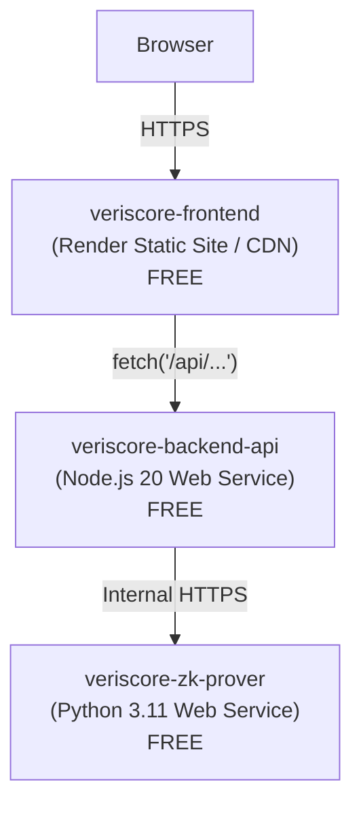

# Deploying Veriscore to Render (Free Tier)

This guide deploys the entire multi-layer **Veriscore** ZK-AI stack to [Render](https://render.com) using the **free tier** — no credit card required.

---

## Architecture on Render Free Tier



> **Key difference from Docker**: Render's free tier uses **native runtimes** (not Docker).
> The frontend is served from Render's global CDN as a static site, and calls the backend
> API directly via its public URL (no nginx reverse proxy needed).

| # | Service | Render Type | Runtime | Cost |
|---|---------|-------------|---------|------|
| 1 | `veriscore-zk-prover` | Web Service | Python 3.11 | **Free** |
| 2 | `veriscore-backend-api` | Web Service | Node.js 20 | **Free** |
| 3 | `veriscore-frontend` | Static Site | Vite Build → CDN | **Free** |

---

## Free Tier Limitations

| Constraint | Impact |
| :--- | :--- |
| **512 MB RAM** per service | torch is excluded from the ZK prover (not needed at runtime) to stay within limit |
| **Spins down after 15 min** of no traffic | First request after idle takes ~30-60s (cold start + ZK circuit setup) |
| **Ephemeral filesystem** | ZK setup artifacts (proving.key, verifying.key) are regenerated on every cold start |
| **750 free build hours/month** | Shared across all services |

---

## Deployment Steps

### Step 1: Push the Blueprint to GitHub

The [`render.yaml`](../render.yaml) Blueprint file is already in your repository. If you haven't pushed it yet:

```powershell
git add render.yaml zk-proving-service/requirements-render.txt docs/render-deployment-guide.md
git commit -m "feat(render): free tier Blueprint with native runtimes"
git push origin main
```

### Step 2: Create the Blueprint on Render

1. Open [https://dashboard.render.com](https://dashboard.render.com) and sign in with GitHub.
2. Click **"New +"** (top right) → **"Blueprint"**.
3. Connect your GitHub account if not already connected.
4. Select the **`Hritikadas/veriscore`** repository.
5. Enter a Blueprint Instance name (e.g., `veriscore`).
6. Click **"Apply"**.

Render reads `render.yaml` and automatically creates all 3 services, wires their environment variables, and starts building.

### Step 3: Wait for Builds to Complete

Watch the Render Dashboard. Each service will show:
- **Building** → Installing dependencies and compiling
- **Live** → Service is up and accepting traffic

The ZK Prover build takes the longest (~5-8 min) because it installs `ezkl` and `onnxruntime`.

### Step 4: Verify the Deployment

Once all three services show **"Live"**:

1. Open the **frontend URL** (e.g., `https://veriscore-frontend.onrender.com`).
2. Submit a test loan decision:
   - Annual Income: `100000`
   - Credit Score: `800`
   - Employment: `10` years
3. The first request triggers ZK circuit setup (~30s on cold start). Subsequent requests are fast (~1-3s).

---

## Manual Deployment (Without Blueprint)

If you prefer to set up each service individually:

### Service 1: ZK Prover

1. Render Dashboard → **New +** → **Web Service** → select `Hritikadas/veriscore`.
2. Configure:
   - **Name**: `veriscore-zk-prover`
   - **Runtime**: Python 3
   - **Build Command**: `pip install -r zk-proving-service/requirements-render.txt`
   - **Start Command**: `cd zk-proving-service && uvicorn api_server:app --host 0.0.0.0 --port $PORT`
   - **Plan**: Free
3. Environment Variables:
   - `PYTHONUNBUFFERED` = `1`
   - `HOME` = `/tmp`
   - `PYTHON_VERSION` = `3.11.0`
4. Click **Create Web Service**.
5. **Copy the live URL** (e.g., `https://veriscore-zk-prover.onrender.com`).

### Service 2: Backend API

1. **New +** → **Web Service** → select `Hritikadas/veriscore`.
2. Configure:
   - **Name**: `veriscore-backend-api`
   - **Runtime**: Node
   - **Build Command**: `cd backend-api && npm ci`
   - **Start Command**: `cd backend-api && node server.js`
   - **Plan**: Free
3. Environment Variables:
   - `NODE_ENV` = `production`
   - `PROVER_SERVICE_URL` = `https://veriscore-zk-prover.onrender.com` *(paste the URL from step 1)*
4. Click **Create Web Service**.
5. **Copy the live URL** (e.g., `https://veriscore-backend-api.onrender.com`).

### Service 3: Frontend (Static Site)

1. **New +** → **Static Site** → select `Hritikadas/veriscore`.
2. Configure:
   - **Name**: `veriscore-frontend`
   - **Build Command**: `cd frontend && npm ci && npm run build`
   - **Publish Directory**: `frontend/dist`
3. Environment Variables:
   - `VITE_API_URL` = `https://veriscore-backend-api.onrender.com` *(paste the URL from step 2)*
4. Add a **Rewrite Rule**: Source `/*` → Destination `/index.html` (for SPA routing).
5. Click **Create Static Site**.

---

## Troubleshooting

| Problem | Solution |
| :--- | :--- |
| Frontend loads but API calls fail | Ensure `VITE_API_URL` is set to the backend's full `https://...onrender.com` URL and **redeploy** the frontend (Vite bakes env vars at build time). |
| "Service unavailable" on first request | Normal — the free tier spins down after 15 min. Wait 30-60s for cold start + ZK setup. |
| ZK Prover build fails (out of memory) | Verify you're using `requirements-render.txt` (without `torch`). |
| Backend can't reach ZK Prover | Check `PROVER_SERVICE_URL` env var on the backend service points to the correct prover URL. |
| CORS errors in browser console | The backend already has `app.use(cors())` enabled. If it persists, check the backend is actually running (not spun down). |
