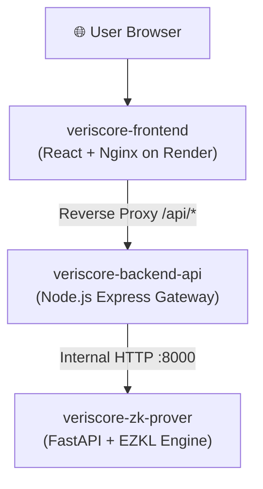

# Deploying Veriscore to Render

This guide outlines the end-to-end steps to deploy the multi-layer **Veriscore** stack to [Render](https://render.com).

---

## Architecture on Render



The system consists of three decoupled services defined in [`render.yaml`](../render.yaml):

| Service Name | Layer | Runtime | Internal Port | Public URL Format |
| :--- | :--- | :--- | :--- | :--- |
| **`veriscore-zk-prover`** | ZK Proving Microservice | Docker (Python 3.11 + ezkl) | `8000` | `https://veriscore-zk-prover.onrender.com` |
| **`veriscore-backend-api`** | Gateway & Orchestration | Docker (Node.js 20 Express) | `5000` | `https://veriscore-backend-api.onrender.com` |
| **`veriscore-frontend`** | Web Dashboard & Demo | Docker (React + Vite + Nginx) | `80` | `https://veriscore-frontend.onrender.com` |

---

## Method 1: One-Click Blueprint Deployment (Recommended)

Render's Blueprint feature reads [`render.yaml`](../render.yaml) and automatically creates and connects all three services in one step.

### Steps:
1. Push [`render.yaml`](../render.yaml) to your GitHub repository:
   ```powershell
   git add render.yaml docs/render-deployment-guide.md
   git commit -m "feat(render): add Blueprint specification and deployment guide"
   git push origin main
   ```
2. Log into [Render Dashboard](https://dashboard.render.com).
3. Click the **"New +"** button at the top right $\rightarrow$ select **"Blueprint"**.
4. Connect your GitHub account and select the **`Hritikadas/veriscore`** repository.
5. Enter a **Blueprint Instance Name** (e.g., `veriscore-production`).
6. Click **"Apply"**.
7. Render will automatically build all 3 Docker containers and interconnect their environment variables.

---

## Method 2: Manual Step-by-Step Deployment on Render

If you prefer to configure each service manually via the Render Web UI:

### 1. Deploy `veriscore-zk-prover` (Step 1)
1. In Render Dashboard, click **New +** $\rightarrow$ **Web Service**.
2. Select repository `Hritikadas/veriscore`.
3. Configure:
   - **Name**: `veriscore-zk-prover`
   - **Language / Runtime**: `Docker`
   - **Dockerfile Path**: `zk-proving-service/Dockerfile`
   - **Docker Build Context**: `.`
   - **Health Check Path**: `/health`
4. Environment Variables:
   - `PYTHONUNBUFFERED`: `1`
   - `HOME`: `/app`
5. Click **Create Web Service**. Note the assigned URL (e.g. `https://veriscore-zk-prover.onrender.com`).

---

### 2. Deploy `veriscore-backend-api` (Step 2)
1. Click **New +** $\rightarrow$ **Web Service**.
2. Select repository `Hritikadas/veriscore`.
3. Configure:
   - **Name**: `veriscore-backend-api`
   - **Language / Runtime**: `Docker`
   - **Dockerfile Path**: `backend-api/Dockerfile`
   - **Docker Build Context**: `.`
   - **Health Check Path**: `/api/health`
4. Environment Variables:
   - `NODE_ENV`: `production`
   - `PROVER_SERVICE_URL`: `https://veriscore-zk-prover.onrender.com` *(or internal host `http://veriscore-zk-prover:8000`)*
5. Click **Create Web Service**. Note the assigned URL (e.g. `https://veriscore-backend-api.onrender.com`).

---

### 3. Deploy `veriscore-frontend` (Step 3)
1. Click **New +** $\rightarrow$ **Web Service**.
2. Select repository `Hritikadas/veriscore`.
3. Configure:
   - **Name**: `veriscore-frontend`
   - **Language / Runtime**: `Docker`
   - **Dockerfile Path**: `frontend/Dockerfile`
   - **Docker Build Context**: `.`
   - **Health Check Path**: `/`
4. Click **Create Web Service**.
5. Once deployed, open `https://veriscore-frontend.onrender.com` in your browser!

---

## Verification & Health Check Checklist

Once Render finishes deploying:

- [ ] Open `https://<your-frontend>.onrender.com` $\rightarrow$ Landing page and demo form should load.
- [ ] Submit a test loan decision (e.g., Annual Income: `$100,000`, Credit Score: `800`, Employment: `10` years).
- [ ] Ensure the Zero-Knowledge Halo2/KZG cryptographic proof generates and verifies on-screen.
- [ ] Check `/api/models` registry endpoint returns status 200 with model schema metadata.
