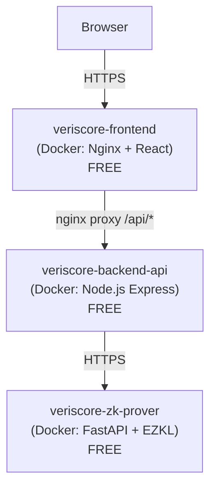

# Deploying Veriscore on Render — FREE with Docker

Deploy the full **Veriscore** multi-layer ZK-AI stack to [Render](https://render.com) using **Docker containers on the free tier**. No credit card required.

---

## Architecture



| # | Service | Dockerfile | Base Image | Cost |
|---|---------|-----------|------------|------|
| 1 | `veriscore-zk-prover` | `zk-proving-service/Dockerfile.render` | `python:3.11-slim` | **Free** |
| 2 | `veriscore-backend-api` | `backend-api/Dockerfile.render` | `node:20-alpine` | **Free** |
| 3 | `veriscore-frontend` | `frontend/Dockerfile.render` | `nginx:1.27-alpine` | **Free** |

### What's Different from the Local Docker Setup?

| Aspect | Local (`docker compose`) | Render Free Docker |
| :--- | :--- | :--- |
| Port assignment | Hardcoded (8000, 5000, 80) | Dynamic via `$PORT` env var |
| Inter-service networking | Docker bridge DNS (`backend-api:5000`) | Public `.onrender.com` URLs |
| torch dependency | Included (~2GB) | Excluded via `requirements-render.txt` (not needed at runtime) |
| Nginx API proxy target | `http://backend-api:5000` | `$BACKEND_URL` (envsubst at startup) |

---

## Deploy in 3 Steps

### Step 1: Push to GitHub

```powershell
git add -A
git commit -m "feat(render): Docker free tier deployment"
git push origin main
```

### Step 2: Create the Blueprint on Render

1. Open [https://dashboard.render.com](https://dashboard.render.com) and sign in with GitHub.
2. Click **"New +"** (top right) → **"Blueprint"**.
3. Select the **`Hritikadas/veriscore`** repository.
4. Enter a name (e.g., `veriscore`) → click **"Apply"**.

Render reads `render.yaml` and creates all 3 Docker services automatically.

### Step 3: Wait and Verify

- Builds take **~10-15 minutes** (the ZK prover image is the largest).
- Once all 3 show **"Live"**, open `https://veriscore-frontend.onrender.com`.
- Submit a test loan: Income `100000`, Credit `800`, Employment `10`.

> **First request takes ~30-60s** (cold start + ZK circuit key generation). Subsequent requests are fast (~1-3s).

---

## Manual Setup (Without Blueprint)

### 1. Deploy ZK Prover
- **New +** → **Web Service** → select `Hritikadas/veriscore`
- **Runtime**: Docker
- **Dockerfile Path**: `zk-proving-service/Dockerfile.render`
- **Docker Build Context**: `.`
- **Plan**: Free
- **Env Vars**: `PYTHONUNBUFFERED=1`, `HOME=/app`
- Copy the URL (e.g., `https://veriscore-zk-prover.onrender.com`)

### 2. Deploy Backend API
- **New +** → **Web Service** → select `Hritikadas/veriscore`
- **Runtime**: Docker
- **Dockerfile Path**: `backend-api/Dockerfile.render`
- **Docker Build Context**: `.`
- **Plan**: Free
- **Env Vars**: `NODE_ENV=production`, `HOST=0.0.0.0`, `PROVER_SERVICE_URL=https://veriscore-zk-prover.onrender.com`
- Copy the URL (e.g., `https://veriscore-backend-api.onrender.com`)

### 3. Deploy Frontend
- **New +** → **Web Service** → select `Hritikadas/veriscore`
- **Runtime**: Docker
- **Dockerfile Path**: `frontend/Dockerfile.render`
- **Docker Build Context**: `.`
- **Plan**: Free
- **Env Vars**: `BACKEND_URL=https://veriscore-backend-api.onrender.com`

---

## Free Tier Limits

| Constraint | Detail |
| :--- | :--- |
| **RAM** | 512 MB per service (torch excluded to fit) |
| **CPU** | 0.1 vCPU |
| **Sleep** | Spins down after 15 min inactivity; ~30-60s cold start |
| **Hours** | 750 free instance-hours/month shared across services |
| **Filesystem** | Ephemeral — ZK keys regenerated on each cold start |

---

## Troubleshooting

| Problem | Fix |
| :--- | :--- |
| Frontend loads but API calls fail (CORS/404) | Check `BACKEND_URL` env var on the frontend service points to the backend's full `https://...onrender.com` URL. Redeploy the frontend service. |
| "Service unavailable" on first visit | Normal cold start on free tier. Wait 30-60s. |
| ZK Prover crashes (out of memory) | Ensure `Dockerfile.render` uses `requirements-render.txt` (not the regular one with torch). |
| Backend can't reach ZK Prover | Check `PROVER_SERVICE_URL` on the backend points to the prover's `.onrender.com` URL. |
